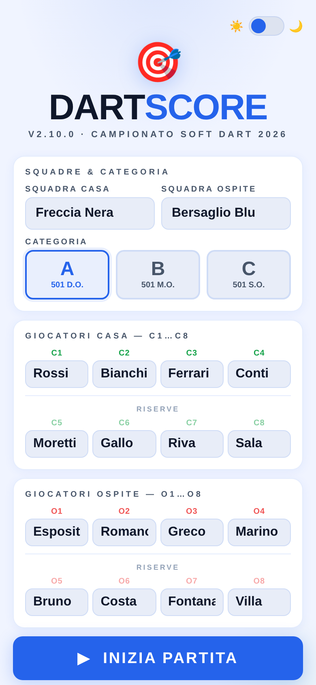
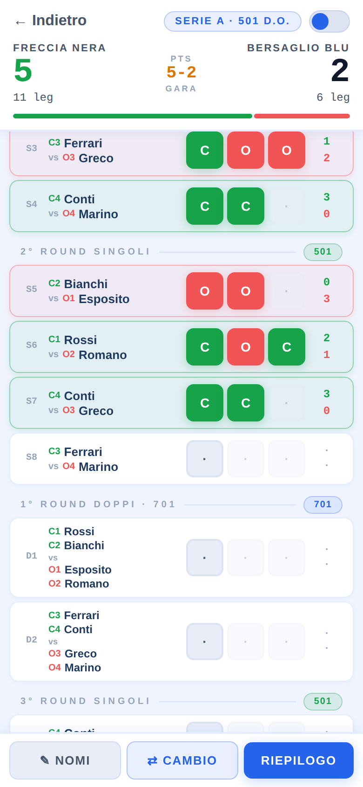
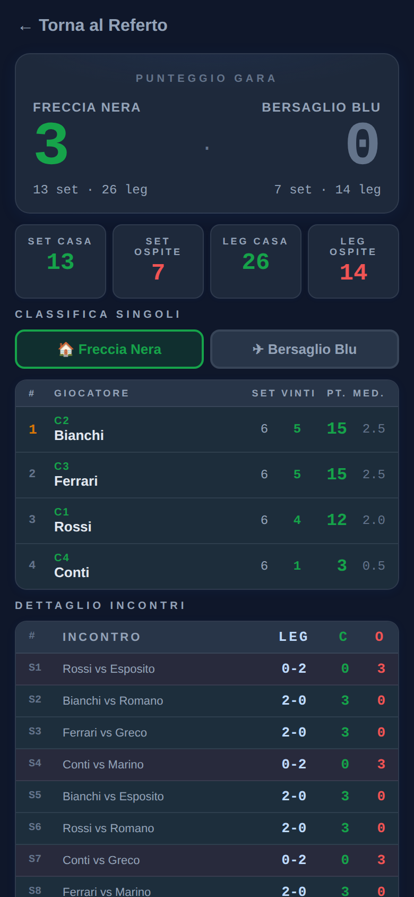

# DARTS SCORE

App web per il calcolo dei punteggi nelle partite di freccette.

## ▶ Apri l'app online

👉 **[Avvia DartScore](https://fanza-vibes.github.io/DARTSCORE/)**

Nessuna installazione necessaria. Si apre direttamente nel browser.

## Schermate

| Setup squadre | Referto in corso | Riepilogo (tema scuro) |
|:---:|:---:|:---:|
|  |  |  |

---

## Descrizione

Darts Score è un'applicazione single-page pensata per calcolare in modo rapido e preciso i punteggi di una partita di freccette, gestendo automaticamente set, leg, squadre e giocatori secondo il regolamento ufficiale FIGeST 2026.

### Funzionalità principali

- Gestione completa di **squadre e giocatori** con modifica nomi anche durante la partita
- Calcolo automatico di **set e leg** secondo il regolamento ufficiale (ART.4.3)
- **Sostituzioni** con cronologia, annullamento e validazione (max 4 per squadra, ART.5.4)
- **Classifica individuale** con punti, media e set vinti (ART.11.2)
- Riepilogo dettagliato con **validazione somma punti** (ART.15.1)
- **Esportazione PDF** del referto gara tramite stampa nativa (zero dipendenze)
- **Impostazioni gara configurabili**: numero di incontri singoli e doppi, leg per set,
  best of N, soglia di vittoria, sostituzioni massime e sistema punti
- **Tema chiaro e scuro** con switch rapido e rispetto della preferenza di sistema
- Interfaccia mobile-first, ottimizzata per l'uso a bordo campo
- **Funziona offline** con il file scaricato in locale; sulla versione web dipende
  dalla cache del browser e non è garantito
- Nessun account, nessuna registrazione, nessun dato inviato a server

### Novità

#### v2.9.3

- **Zoom della pagina abilitato**: prima era bloccato, ora si può ingrandire il testo
- Etichette per screen reader sui bottoni di chiusura dei pannelli
- **Nome file stabile**: l'app è `Darts_Score.html` e non cambia più a ogni versione,
  quindi i link già condivisi non scadono
- Anteprima di condivisione corretta su WhatsApp e Telegram, immagine inclusa

#### v2.9.2

- **Pannello Impostazioni Gara**: incontri singoli e doppi, leg per vincere il set,
  leg massimi (best of N), set per la vittoria netta, sostituzioni massime e
  sistema punti sono ora tutti configurabili
- I valori predefiniti riproducono esattamente il **regolamento FIGeST 2026**;
  il pulsante **"Predefiniti"** ripristina la configurazione ufficiale
- Calendario incontri **generato dinamicamente** dalla configurazione, con schemi
  di rotazione per singoli e doppi al posto degli elenchi fissi
- Calcolo di leg, set e punti generalizzato: funziona con qualsiasi formato,
  non solo il best-of-3 del regolamento
- Validazione della configurazione: combinazioni incoerenti (zero incontri,
  soglia di vittoria irraggiungibile) vengono bloccate con messaggio esplicativo
  e i valori fuori range corretti automaticamente
- La modifica delle impostazioni azzera la partita in corso, previa conferma
- Le impostazioni vengono salvate nel browser e ripristinate alla visita successiva
- Sorgente documentato: mappa del file, intestazioni di sezione e descrizione
  delle funzioni principali

Versioni precedenti

**v2.9.1** — correzioni al pannello Impostazioni: limiti coerenti sui campi,
clamp automatico dei valori fuori range, salvataggio disabilitato con
configurazione incoerente.

**v2.8.1** — refactoring interno, sincronizzazione del meta `color-scheme`
al cambio tema, colonna punti allargata per i bottoni leg.

**v2.8** — tema scuro con toggle in ogni schermata, bottoni leg ingranditi,
scroll automatico al prossimo incontro, modifica nomi squadre durante la partita,
reset completo dei dati salvati, banner stato partita, supporto animazioni
ridotte, anteprima link su WhatsApp/Telegram.

Storico completo e dettagliato in [CHANGELOG.md](CHANGELOG.md).

---

## Come usarla

### Versione web (consigliata)

Il modo più semplice è aprire direttamente il link:

👉 **[https://fanza-vibes.github.io/DARTSCORE/](https://fanza-vibes.github.io/DARTSCORE/)**

Funziona su qualsiasi browser moderno, da telefono o da computer.

> **Uso offline:** la versione web richiede la connessione per l'apertura. Il browser
> può conservare la pagina in cache e riaprirla senza rete, ma è un comportamento
> non garantito e la cache può essere svuotata in qualsiasi momento. Se ti serve la
> certezza di poter aprire l'app a bordo campo senza connessione, scarica il file
> (vedi [Versione scaricabile](#versione-scaricabile-uso-offline-completo)).

**Per aggiungerla alla schermata home del telefono (opzionale):**

- **iPhone (Safari):** tocca l'icona di condivisione ↑ → "Aggiungi a schermata Home"
- **Android (Chrome):** tocca i tre puntini ⋯ → "Aggiungi a schermata Home"

In questo modo si comporta come un'app vera, senza barra del browser.

---

### Versione scaricabile (uso offline completo)

Se preferisci avere il file in locale, senza dipendere da internet:

👉 **[Scarica Darts_Score.html](https://github.com/Fanza-vibes/DARTSCORE/releases/latest/download/Darts_Score.html)**

Questo link scarica sempre l'ultima versione pubblicata. Salva il file dove vuoi e aprilo con un doppio clic: si apre nel browser e funziona offline, senza installare nulla.

> **Su iPhone e Android** il file finisce nell'app *File* (o nella cartella *Download*). Da lì si apre con un tocco, come qualsiasi altro documento.

Tutte le versioni, comprese le precedenti, sono nella [pagina delle Release](https://github.com/Fanza-vibes/DARTSCORE/releases).

---

## Compatibilità

| Browser | Versione minima |
|---------|----------------|
| Chrome  | 88+            |
| Firefox | 78+            |
| Safari  | 14+            |
| Edge    | 88+            |
| Opera   | 74+            |

Testato con fix cross-browser per `dvh`, `inset`, `env()`, `appearance` e `color-scheme`.

Ottimizzazioni specifiche per iOS Safari: gestione touch event, `pagehide` per salvataggio, `visibility:hidden` sui pannelli, safe-area-inset.

---

## Privacy e dati

I dati inseriti nell'app (nomi squadre, nomi giocatori, risultati) vengono gestiti **esclusivamente in locale** nel browser tramite `localStorage` e non vengono mai trasmessi allo sviluppatore. I dati vengono eliminati automaticamente dopo 48 ore oppure all'avvio di una nuova partita. La preferenza del tema (chiaro/scuro) e le impostazioni di gara (numero incontri, sistema punti) vengono salvate separatamente e non contengono dati personali.

La versione web è ospitata tramite **GitHub Pages** (Microsoft/GitHub). Ogni accesso alla pagina genera automaticamente sui server di GitHub un log tecnico standard (indirizzo IP, browser, timestamp). Questi dati sono trattati da GitHub come responsabile del trattamento ai sensi del GDPR — lo sviluppatore non vi ha accesso. Per dettagli, consulta la [GitHub Privacy Statement](https://docs.github.com/en/site-policy/privacy-policies/github-general-privacy-statement).

Per l'informativa completa consulta la sezione **🔒 Informativa Privacy** all'interno dell'app.

---

## Sicurezza

L'app implementa una Content Security Policy (CSP) che blocca il caricamento di risorse esterne (script, font, immagini da CDN). Tutti gli input utente vengono sanitizzati tramite escape HTML per prevenire XSS. Non vengono utilizzate dipendenze esterne di alcun tipo.

---

## Licenza

**Solo uso personale e non commerciale.**

Vedi il file [LICENSE](LICENSE) per i termini completi.

Per richieste di licenza commerciale, apri una [issue](https://github.com/Fanza-vibes/DARTSCORE/issues) sul repository.
